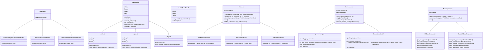

# Diagramme de classes - 

```mermaid
classDiagram
    class Indicators{
        +__call__(pc:PointCloud)
    }

    class NearestNeighborDistanceIndicator{
        +compute(pc:PointCloud)
    }
    Indicators <|--NearestNeighborDistanceIndicator

    class DistanceToYAxisIndicator{
        +compute(pc:PointCloud)
    }
    Indicators <|--DistanceToYAxisIndicator

    class YCoordinateDistributionIndicator{
        +compute(pc:PointCloud)
    }
    Indicators <|--YCoordinateDistributionIndicator

    class PointCloud {
        +name
        +points
        +colors
        +labels
        +size
        +visualiser()
        +normalize()
        +compute_histogram()
        +plot_histogram()
        +duplicate(n:int) -> BatchPointCloud
        +fusion(pc:PointCloud)
    }

    class dictpcd{
        +colors_0
        +colors_1
        +colors_2
        +load(source:dict)
        +save_labelled_point_cloud(save_repository)
    }
    PointCloud <|--dictpcd 

    class npypcd{
        +colors_0
        +colors_1
        +colors_2
        +load(source:str)
        +save_labelled_point_cloud(save_repository)
    }
    PointCloud <|--npypcd

    class plypcd{
        +load(source:str)
        +save_labelled_point_cloud(save_repository)
    }
    PointCloud <|--plypcd

    class BatchPointCloud {
        +points
        +colors
        +labels
        +from_pointcloud(pc:PointCloud)
        +__getitem__(idx:int)
    }

    class Distance{
        +normalize:Bool
        +_normalize(pc:PointCloud) RQ: pas forcement utile
        +_prepare(pc_1:PointCloud, pc_2:PointCloud)
        +compute_cost_matrix(pc_1:PointCloud, pc_2:PointCloud)
        +__repr__()
        +__call__(pc_1: PointCloud, pc_2:PointCloud)

    }


    class EarthMoverDistance{
        +compute(pc_1: PointCloud, pc_2: PointCloud)
    }
    Distance <|-- EarthMoverDistance

    class SinkhornDistance{
        +compute(pc_1:PointCloud, pc_2: PointCloud)
    }
    Distance <|-- SinkhornDistance

    class SchamferDistance{
        +compute(pc_1:PointCloud, pc_2: PointCloud)
    }
    Distance <|-- SchamferDistance   

    class Generateurs {
        +corolle:PointCloud
        +gen_parameters
        +trim_to_pointcloud(source: str)
        +drop(pc:PointCloud)
        +gen_outliers(pc:PointCloud)
        +generate_sphere_points(pc:PointCloud)
    }


    class GenerateurNaif {
        +specific_gen_parameters
        +rd_add_single_sphere(pc:PointCloud, radius:float, density: float)
        +gen_points(pc:PointCloud)
        +gen_dataset()
    }
    Generateurs<|--GenerateurNaif

    class GenerateurIteratif {
        +specific_gen_parameters
        +gen_points(pc:PointCloud)
        +iterative_growth(pc: PointCloud, x, y, z, base_density, base_radius, decay_density, decay_radius, depth_max)
        +gen_dataset()
    }
    Generateurs<|--GenerateurIteratif

    class DataAugmenter{
        +parameters
        +apply_rotation(angle_x, angle_y, angle_z)
        +rotation_matrix_xyz(pc: PointCloud, axis:str, degrees:float)
        +repr()


    }

    class PCDataAugmenter{
        ajout_bruit_gaussien(pc: PointCloud)
        apply_translation(pc: PointCloud)
        apply_random_rotation(pc:PointCloud)
        apply_scaling(pc:PointCloud)
        apply_dropout(pc:PointCloud)
    }
    DataAugmenter<|-- PCDataAugmenter


    class BatchPCDataAugmenter{
        ajout_bruit_gaussien(pc: BatchPointCloud)
        apply_translation(pc: BatchPointCloud)
        apply_random_rotation(pc: BatchPointCloud)
        apply_scaling(pc: BatchPointCloud)
        apply_dropout(pc: BatchPointCloud)
    }
    DataAugmenter<|-- BatchPCDataAugmenter


 
```